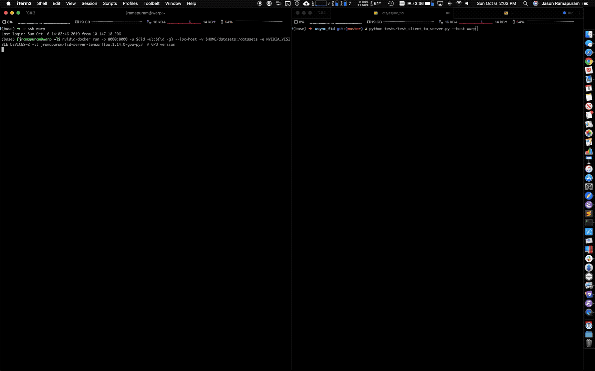

# async_fid

Asynchronous, Synchronous and [RPC](https://rpyc.readthedocs.io/en/latest/index.html) Tensorflow [FID](https://arxiv.org/abs/1706.08500) calculation helpers. This repo extends the code that was generously written by [1](https://github.com/daib13/TwoStageVAE/blob/master/fid_score.py) and [2](https://github.com/bioinf-jku/TTUR/blob/master/fid.py) while providing some nice extras & a cleaner interface and the ability to **send your FID calculation to a remote server for calculation!**



## Client-Server Solution

### PyRPC Server Setup

The simplest way to get started is replace `<MY_HOST_DATASET_DIR>` to the place you want to store the datasets and and run the following command on the server (note datasets are mostly auto-downloaded, except for Imagenet / Celeb-A):

``` bash
nvidia-docker run -p 8000:8000 -u $(id -u):$(id -g) \
                               --ipc=host -v <MY_HOST_DATASET_DIR>:/datasets \
                               -e NVIDIA_VISIBLE_DEVICES=0 \
                               -it jramapuram/fid-server-tensorflow:1.14.0-gpu-py3  # GPU version

# or if you want the CPU version:
docker run -p 8000:8000 -u $(id -u):$(id -g) \
                        --ipc=host -v <MY_HOST_DATASET_DIR>:/datasets \
                        -it jramapuram/fid-server-tensorflow:1.14.0-py3  # CPU version
```

### PyRPC Client Setup

Posting messages to a remote FID-computing server is simple!  

``` python
from client import FIDClient

# be sure to fill out host & port below with your server's IP / hostname
fid = FIDClient(host, port, normalize_imgs=True, force_cpu=False)
fid.add_dataset(task='mnist', data_dir='./datasets/mnist') # add a dataset (mostly auto-downloads)

def do_something_with_fid(fid_value):
  # save to disk? post to tensorboard / visdom
  # treat fid_value as a simple python float

# calculate fid for random data, this function instantly returns so you can continue training :D
# do_something_with_fid is triggered from the remote when it is completed and is run asynchronously here.
fid.post(fake_images=np.random.rand(10000, 28, 28, 1), 
         do_something_with_fid, dataset_str='mnist')
         
# instead of using the full MNIST dataset like above post your own test images
fid.post_with_images(fake_images=np.random.rand(10000, 28, 28, 1), 
                     real_images=np.random.rand(10000, 28, 28, 1), 
                     do_something_with_fid)
```

(See `test_client_to_server.py` for an end-to-end example.)

## Non Client-Server Solution

### Sync-Tests

To test the sync version run `python test_sync.py` (or `./docker/run.sh "python test_sync.py"` to use the pre-baked container), here are the results for some typical datasets:

``` bash
[mnist]
        FID for random data vs. test-set : 419.81745204835573.
        FID for test-set vs. test-set : 2.000466499576364e-05
...

[permuted] # actually is doing permuted-mnist
        FID for random data vs. test-set : 336.31173076137065.
        FID for test-set vs. test-set : 1.149141822937758e-05
...

[fashion]
        FID for random data vs. test-set : 402.12138184169527.
        FID for test-set vs. test-set : 7.3852093285004855e-06
...

[cifar10]
        FID for random data vs. test-set : 415.6104467123265.
        FID for test-set vs. test-set : 0.23097138537141707
...

[cifar100]
        FID for random data vs. test-set : 423.52608082034476.
        FID for test-set vs. test-set : 0.27762879099949245
...

[svhn_full]
        FID for random data vs. test-set : 411.5628830393524.
        FID for test-set vs. test-set : 4.3500883367190895
...

[svhn_centered]
        FID for random data vs. test-set : 393.96311903676656.
        FID for test-set vs. test-set : 9.076697602166995
...

[binarized_mnist]
        FID for random data vs. test-set : 446.37204352094204.
        FID for test-set vs. test-set : 3.524291969370097e-12
...

[binarized_omniglot]
        FID for random data vs. test-set : 440.3752313180992.
        FID for test-set vs. test-set : 0.0034667244183284635
...

[binarized_omniglot_burda]
        FID for random data vs. test-set : 400.55568682515616.
        FID for test-set vs. test-set : 0.2629414960831542
...

[celeba]
        FID for random data vs. test-set : 454.7212195100483.
        FID for test-set vs. test-set : 1.2387706087668702
...

[image_folder] # evaluating 32x32 imagenet raw imgs
        FID for random data vs. test-set : 425.07742193926936.
        FID for test-set vs. test-set : 5.2435325640107235
```

### Async-Tests

Similarly to the sync solution run :
```bash
python test_async.py # (or ./docker/run.sh python test_async.py)
```
